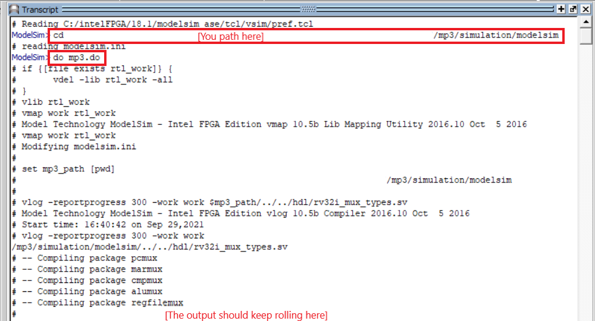
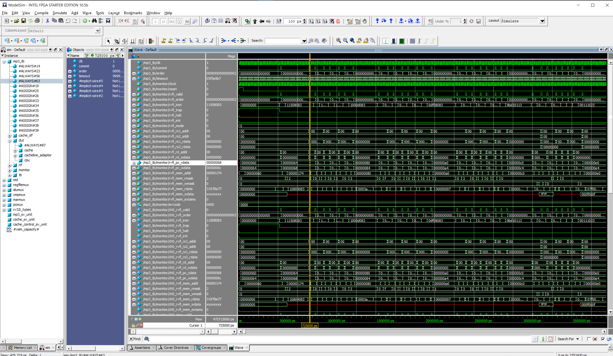

# MP3 with golden CPU

## Purpose
The course staffs decided to release a golden version of the MP2 because of the AG issues that we have been facing thus far. The MP2 solution is **ENCRYPTED** (of course :), but you can still run ModelSim on it to test your MP3 cache design. The purpose of this release is for you to make sure that bugs in your MP3 is not an error caused by your MP2. See the submission section for how grading works. 

## Overview
- With the golden design, you can do the following
  - Run ModelSim simulation with the encrypted copy
- Things that you are **NOT able to do**, however...
  - Peek into the golden design :) (or not? try to break AES-128? not worth it...)
  - Checking waveform for signals in the CPU
  - **Run timing/synthesis** (more on this in the Timing section)

## Before you start
1. Make sure the fetch/clone steps are done for MP3.
2. Download the `mp3.do` and `cpu_golden.vp`.
4. Move `mp3.do` into `[PATH_TO_YOUR_GIT_REPO]/mp3/simulation/modelsim`
5. Change the `cpu cpu(.*);` to `cpu_golden cpu(.*);` in `mp3.sv` (not `mp3.do`) 
6. Organize your `hdl/` files like the following in your folder. **Keep everything else the same!**
```
hdl
├── cache
│   ├── array.sv
│   ├── bus_adapter.sv
│   ├── cache.sv
│   ├── cache.sv.bak
│   ├── cache_control.sv
│   ├── cache_control.sv.bak
│   ├── cache_datapath.sv
│   └── data_array.sv
├── cacheline_adaptor.sv
├── cpu_golden.vp
├── mp3.sv
├── rv32i_mux_types.sv
└── rv32i_types.sv
```
7. Navigate to your MP3 folder in either terminal or GUI (we need the path later).


## Run ModelSim with your design
1. Open ModelSim
2. `cd` to the `[PATH_TO_YOUR_GIT_REPO]/mp3/simulation/modelsim` folder.
3. Run the `mp3.do`:
```
do mp3.do
```


4. If everything goes well, the simulation steps from now on should be the same as your previous MPs. 

## Timing
- Running timing and synthesis with the encrypted MP2 requires a Quartus Prime Pro edition software. The EWS offers such software, but we do not recommend this approach because the workflow in the Pro edition is very different from the Standard edition.
- Instead of running the encrypted MP2, you can run the timing/synthesis with **your own MP2 CPU** + your MP3 cache. The `.sdc` setups are the same for MP2. 
- **There's no need to commit the `.sdc` file for autograding**, we will replace it with our `.sdc`. 

## Submission
- Commit the following
   * Changes in `hdl/cache/`
   * `hdl/cpu_golden.sv`
   * `hdl/cacheline_adaptor.sv`
   * `hdl/mp3.sv`
- The AG will grade on timing based on only your MP3 cache.
- The AG will test your design correctness with the golden CPU.

## Things to note
1. Although we provide you a perfect implementation of the MP2, the simulation does not have access to the internal of this perfect CPU. We recommend the following for debugging
   * Run the simulation and inspect the signals using the monitor
	
   * Note that signals starting with `rvfi_` are the ones that our CPU passes into the monitor. 
   * Signals starting with `ch0_`, `rob_` are the internal signals for the monitor, which might/might not be useful.
   * Signals like `inst`, `pc_rdata` tells you what the current instruction is.
2. Let us know if you run into any issues with the golden design on Piazza.
